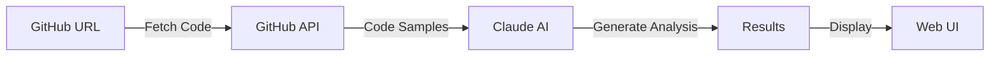

# smar-ai 🧠

> Your Code, Remembered. Understand any GitHub repository with AI-powered analysis.


## What is smar-ai?

smar-ai is an intelligent code analyzer that uses Claude AI to understand and explain GitHub repositories. Instead of spending hours reading through code, get a comprehensive analysis in seconds.

### Key Features

- 📊 **Smart Analysis** - AI-powered code understanding
- 🎯 **Multiple Formats** - Overview, detailed explanation, or learning guide
- ⚡ **Real-time Streaming** - See results as they're generated
- 🎨 **Beautiful UI** - Modern dark interface with syntax highlighting
- 📥 **Export Options** - Copy or download analysis as markdown
- 🔗 **Easy to Use** - Just paste a GitHub URL
- 🚀 **Cloud Ready** - Deploy to Railway + Netlify

## Quick Start

### Online Demo
Visit deployed version (update with your deployed URL):
- Frontend: https://smar-ai.netlify.app
- Backend: https://smar-ai-api.railway.app

### Local Development

**Prerequisites:**
- Node.js 16+
- Anthropic API Key ([get one free](https://console.anthropic.com))

**Setup:**

```bash
# Clone the repository
git clone https://github.com/yourusername/smar-ai.git
cd smar-ai

# Backend
cd server
cp .env.example .env
# Edit .env with your ANTHROPIC_API_KEY
npm install
npm run dev

# In a new terminal - Frontend
cd client
npm install
npm run dev
```

Visit `http://localhost:3000`

## How It Works



### Analysis Types

1. **📋 Code Overview** - High-level understanding
   - Project purpose and goals
   - Technology stack
   - Architecture overview
   - Key components

2. **📖 Detailed Explanation** - Deep dive
   - File structure breakdown
   - Data flow and algorithms
   - Design patterns
   - Setup and configuration

3. **🎓 Learning Guide** - Educational
   - Prerequisites
   - Step-by-step learning path
   - Core concepts
   - Hands-on activities

## Using AI in smar-ai

### Claude API Integration

We use **Claude Opus 4.5** for intelligent analysis:

```javascript
// Example: How we generate analysis
const analysis = await client.messages.create({
  model: 'claude-opus-4-5-20251101',
  max_tokens: 2000,
  messages: [{
    role: 'user',
    content: `Analyze this repository:
    Name: ${repo.name}
    Files: ${codeSnippets}

    Provide: 1. Purpose 2. Tech Stack 3. Architecture`
  }]
})
```

### Why Claude?

- **Code Understanding** - Reads and comprehends complex codebases
- **Clear Explanations** - Generates human-readable analysis
- **Learning Guides** - Adapts content for different skill levels
- **Pattern Recognition** - Identifies design patterns and best practices
- **Real-time Streaming** - Stream responses for instant feedback

## API Reference

### Analyze Repository

**POST** `/api/analyze`

```bash
curl -X POST http://localhost:5000/api/analyze \
  -H "Content-Type: application/json" \
  -d '{
    "repoUrl": "https://github.com/facebook/react",
    "analysisType": "overview"
  }'
```

**Parameters:**
- `repoUrl` (string, required): GitHub repository URL
- `analysisType` (string): `overview`, `detailed`, or `learning`

**Response:**
```json
{
  "success": true,
  "repository": {
    "name": "react",
    "owner": "facebook",
    "description": "...",
    "language": "JavaScript",
    "stars": 200000
  },
  "analysis": "Comprehensive AI-generated analysis...",
  "filesAnalyzed": 15,
  "timestamp": "2025-02-04T..."
}
```

### Stream Analysis

**POST** `/api/analyze-stream`

Get real-time results using Server-Sent Events (SSE).

### Repository Info

**GET** `/api/repo-info?repoUrl=owner/repo`

Get metadata without full analysis.

## Deployment

### Railway (Backend)

1. Connect GitHub repository to Railway
2. Set environment variables:
   ```
   ANTHROPIC_API_KEY=sk-ant-...
   GITHUB_TOKEN=ghp_... (optional)
   PORT=5000
   ```
3. Railway auto-detects Node.js and deploys

[Railway Setup Guide →](./SETUP.md#railway-backend)

### Netlify (Frontend)

1. Connect GitHub repository to Netlify
2. Set build settings:
   - Base directory: `client`
   - Build command: `npm run build`
   - Publish directory: `dist`
3. Set environment:
   ```
   VITE_API_URL=https://your-railway.railway.app/api
   ```

[Netlify Setup Guide →](./SETUP.md#netlify-frontend)

## Project Structure

```
smar-ai/
├── server/
│   ├── src/
│   │   ├── index.js              # Express server
│   │   ├── services/
│   │   │   ├── githubService.js  # GitHub API integration
│   │   │   └── aiService.js      # Claude AI integration
│   │   └── routes/
│   │       └── analyze.js        # API endpoints
│   ├── .env.example
│   └── package.json
├── client/
│   ├── src/
│   │   ├── components/
│   │   │   ├── RepoAnalyzer.jsx
│   │   │   ├── SearchBar.jsx
│   │   │   ├── AnalysisResults.jsx
│   │   │   └── MarkdownRenderer.jsx
│   │   ├── App.jsx
│   │   └── index.css
│   ├── .env.example
│   ├── netlify.toml
│   └── vite.config.js
├── SETUP.md
└── README.md
```

## Environment Variables

**Server (`server/.env`):**
```
PORT=5000
ANTHROPIC_API_KEY=sk-ant-xxx
GITHUB_TOKEN=ghp_xxx  # Optional
```

**Client (`client/.env`):**
```
VITE_API_URL=http://localhost:5000/api
```

## Features

### Current ✅
- GitHub repository analysis
- Multiple analysis types
- Real-time streaming
- Dark theme UI
- Copy/download results
- Syntax highlighting

### Planned 🚀
- Repository comparison
- Code quality metrics
- Custom prompts
- Saved history
- Export to PDF/HTML
- Team collaboration
- Browser extension
- CLI tool

## Tech Stack

**Frontend:**
- React 19
- Vite
- Axios
- CSS3

**Backend:**
- Node.js
- Express
- Anthropic SDK
- GitHub API

**Deployment:**
- Railway
- Netlify

## Contributing

Contributions welcome! Please:

1. Fork the repository
2. Create feature branch: `git checkout -b feature/amazing-feature`
3. Commit changes: `git commit -m "Add amazing feature"`
4. Push to branch: `git push origin feature/amazing-feature`
5. Open Pull Request

## Troubleshooting

**Q: "Invalid GitHub URL"**
A: Use format `https://github.com/owner/repo` or `owner/repo`

**Q: "API key not found"**
A: Create `server/.env` and add `ANTHROPIC_API_KEY`

**Q: Rate limit errors**
A: Add `GITHUB_TOKEN` for higher GitHub API limits

See [SETUP.md](./SETUP.md#troubleshooting) for more help.

## Roadmap

- [ ] Repository comparison tool
- [ ] Code quality metrics
- [ ] Custom analysis prompts
- [ ] Saved analyses history
- [ ] PDF/HTML export
- [ ] Team collaboration
- [ ] Browser extension
- [ ] CLI tool
- [ ] Advanced filtering
- [ ] API rate limiting tiers

## License

ISC License - See LICENSE file for details

## Support

- 📖 [Setup Guide](./SETUP.md)
- 🐛 [Report Issues](https://github.com/yourusername/smar-ai/issues)
- 💬 [Discussions](https://github.com/yourusername/smar-ai/discussions)
- 📧 Contact: your-email@example.com

## Acknowledgments

- Built with [Claude AI](https://claude.ai) from Anthropic
- Powered by [React](https://react.dev) and [Vite](https://vite.dev)
- Deployed on [Railway](https://railway.app) and [Netlify](https://netlify.com)

---

**Made with ❤️ for code understanding**
