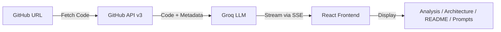

# smar-ai 🧠

> Understand any code, fast.


**Live app:** https://smarai.rishmi5h.com

## What is smar-ai?

smar-ai is an AI-powered GitHub repository analyzer that helps you understand, review, and work with any codebase. Paste a GitHub URL and get instant AI-generated analysis, architecture diagrams, README generation, PR/issue reviews, and copy-pasteable prompts you can give to any LLM to recreate or extend the project.

Powered by **Groq** (llama-3.3-70b-versatile) for blazing-fast inference.

### Key Features

- 📊 **Smart Analysis** — AI-powered code understanding with 3 analysis modes (Overview, Detailed, Learning Guide)
- 🏗️ **Architecture Diagrams** — Auto-generated interactive dependency graphs with Mermaid.js and AI explanations
- 📝 **README Generator** — One-click professional README.md generation from repository code
- 🧩 **Prompt Generator** — Generate copy-pasteable prompts to recreate, extend, review, or migrate any codebase
- 🔀 **PR & Issue Analysis** — Paste a PR or issue URL for targeted AI review with diff analysis
- 📈 **Codebase Evolution** — Compare how code changed between any two commits
- 💬 **Interactive Q&A** — Chat with the AI about the analyzed repository
- ⚡ **Real-time Streaming** — See results as they're generated via Server-Sent Events
- 🎨 **Beautiful UI** — Modern, responsive interface with syntax highlighting and dark theme
- 📥 **Export Options** — Copy or download analysis, README, and prompts

## Quick Start

### Prerequisites

- Node.js 20+
- A [Groq API key](https://console.groq.com) (free tier available)
- A [GitHub token](https://github.com/settings/tokens) (optional, for higher rate limits)

### Setup

```bash
# Clone the repository
git clone https://github.com/rishmi5h/smar-ai.git
cd smar-ai

# Backend
cd server
cp .env.example .env
# Edit .env with your GROQ_API_KEY
npm install
npm run dev

# In a new terminal — Frontend
cd client
npm install
npm run dev
```

Visit `http://localhost:5173`

## How It Works



1. **Paste a URL** — Repository, PR, or Issue URL
2. **Choose analysis type** — Overview, Detailed, or Learning Guide
3. **Explore tabs** — Analysis, Changes, Architecture, README, Prompts
4. **Export** — Copy, download, or use generated prompts with any LLM

## Features in Detail

### Analysis Modes

| Mode | What You Get |
|------|-------------|
| **Code Overview** | Purpose, tech stack, architecture, key components |
| **Detailed Explanation** | File structure, data flow, design patterns, configuration |
| **Learning Guide** | Prerequisites, step-by-step learning path, hands-on activities |

### Architecture Diagrams

Automatically maps file dependencies across your codebase. Supports imports from JavaScript, TypeScript, Python, Go, Java, and Rust. Renders interactive Mermaid diagrams with zoom, pan, and SVG download.

### README Generator

One-click generation of a professional README.md including project overview, features, tech stack, setup instructions, project structure, and contributing guidelines. Streams in real-time with copy and download options.

### Prompt Generator

Generate prompts you can paste into **any** LLM (Claude, ChatGPT, Cursor, Copilot) to:

| Prompt Type | Description |
|------------|-------------|
| **Recreate This Project** | Full blueprint with tech stack, file structure, build order, and implementation patterns |
| **Add a Feature** | Convention-aware guide specifying files to create, patterns to follow, and wiring instructions |
| **Code Review** | Context-rich review prompt with focus areas, checklists, and output format |
| **Convert / Migrate** | Migration strategy with pattern mapping, file-by-file plan, and dependency replacements |

Migration presets: JS → TS, React → Next.js, Express → Fastify, REST → GraphQL, Flask → FastAPI, CJS → ESM, or custom targets.

### PR & Issue Analysis

Paste a PR URL to get AI-powered diff review with file-by-file analysis. Paste an issue URL for context-aware discussion and suggested approaches.

### Codebase Evolution

Compare any two commits to see how the codebase evolved — structural changes, new patterns introduced, and code quality shifts.

### Interactive Q&A

After analysis, chat with the AI about the repository. Ask follow-up questions about architecture, patterns, or specific files.

## API Reference

All streaming endpoints use Server-Sent Events (SSE) for real-time responses.

### Analyze Repository

**POST** `/api/analyze-stream`

```bash
curl -X POST http://localhost:5050/api/analyze-stream \
  -H "Content-Type: application/json" \
  -d '{"repoUrl": "https://github.com/facebook/react", "analysisType": "overview"}'
```

### Analyze PR

**POST** `/api/analyze-pr`

```bash
curl -X POST http://localhost:5050/api/analyze-pr \
  -H "Content-Type: application/json" \
  -d '{"prUrl": "https://github.com/owner/repo/pull/123"}'
```

### Analyze Issue

**POST** `/api/analyze-issue`

```bash
curl -X POST http://localhost:5050/api/analyze-issue \
  -H "Content-Type: application/json" \
  -d '{"issueUrl": "https://github.com/owner/repo/issues/456"}'
```

### Generate Architecture

**POST** `/api/architecture`

```bash
curl -X POST http://localhost:5050/api/architecture \
  -H "Content-Type: application/json" \
  -d '{"repoUrl": "https://github.com/owner/repo"}'
```

### Generate README

**POST** `/api/readme`

```bash
curl -X POST http://localhost:5050/api/readme \
  -H "Content-Type: application/json" \
  -d '{"repoUrl": "https://github.com/owner/repo"}'
```

### Generate Prompt

**POST** `/api/generate-prompt`

```bash
curl -X POST http://localhost:5050/api/generate-prompt \
  -H "Content-Type: application/json" \
  -d '{"repoUrl": "https://github.com/owner/repo", "promptType": "recreate"}'
```

Prompt types: `recreate`, `feature`, `review`, `migrate`

### Compare Changes

**POST** `/api/changes`

### Chat with Repository

**POST** `/api/chat`

### Repository Info

**GET** `/api/repo-info?repoUrl=owner/repo`

## Project Structure

```
smar-ai/
├── server/
│   ├── src/
│   │   ├── index.js                  # Express server entry point
│   │   ├── services/
│   │   │   ├── groqService.js        # Groq AI — analysis, README, prompts, PR/issue review
│   │   │   ├── githubService.js      # GitHub API — repos, PRs, issues, trees, diffs
│   │   │   ├── importParser.js       # Multi-language import/dependency parser
│   │   │   ├── aiService.js          # AI service abstraction layer
│   │   │   └── ollamaService.js      # Ollama integration (legacy)
│   │   └── routes/
│   │       └── analyze.js            # All API endpoints
│   ├── .env.example
│   ├── Dockerfile
│   └── package.json
├── client/
│   ├── src/
│   │   ├── components/
│   │   │   ├── RepoAnalyzer.jsx      # Main orchestrator — URL detection, routing
│   │   │   ├── SearchBar.jsx         # URL input with type detection (repo/PR/issue)
│   │   │   ├── AnalysisResults.jsx   # Tab container — Analysis, Changes, Architecture, README, Prompts
│   │   │   ├── ArchitecturePanel.jsx # Mermaid diagram + AI analysis
│   │   │   ├── ChangesPanel.jsx      # Commit comparison / codebase evolution
│   │   │   ├── ReadmePanel.jsx       # README generator
│   │   │   ├── PromptPanel.jsx       # Prompt generator (4 types)
│   │   │   ├── ChatPanel.jsx         # Interactive Q&A
│   │   │   ├── PRAnalysisResults.jsx # PR diff review
│   │   │   ├── IssueAnalysisResults.jsx # Issue analysis
│   │   │   ├── MarkdownRenderer.jsx  # Markdown + syntax highlighting + Mermaid
│   │   │   └── LoadingSpinner.jsx    # Loading states
│   │   ├── App.jsx
│   │   └── index.css
│   ├── .env.example
│   ├── Dockerfile
│   ├── nginx.conf
│   ├── netlify.toml
│   └── vite.config.js
├── docker-compose.yml
├── DEPLOYMENT.md
└── README.md
```

## Environment Variables

**Server (`server/.env`):**
```
PORT=5050
GROQ_API_KEY=your_groq_api_key_here
GROQ_MODEL=llama-3.3-70b-versatile
GITHUB_TOKEN=ghp_xxx  # Optional, for higher GitHub API limits
```

**Client (`client/.env`):**
```
VITE_API_URL=http://localhost:5050/api
```

## Tech Stack

**Frontend:**
- React 19 + Vite
- Mermaid.js (architecture diagrams)
- react-syntax-highlighter
- Modern CSS3 with CSS variables

**Backend:**
- Node.js 20 + Express
- Groq SDK (llama-3.3-70b-versatile)
- GitHub REST API v3
- Server-Sent Events (SSE) for streaming

**AI:**
- Groq cloud inference (primary)
- Ollama local inference (legacy support)

**Deployment:**
- Docker & Docker Compose
- Railway (backend)
- Netlify (frontend)
- Nginx

## Deployment

### Option 1: Docker (Recommended)

```bash
./scripts/deploy-docker.sh start
```

[Full Docker guide →](./DEPLOYMENT.md#option-2-docker-deployment)

### Option 2: Railway + Netlify (Cloud)

**Backend (Railway):**
1. Connect GitHub repository to Railway
2. Set environment variables:
   ```
   GROQ_API_KEY=gsk_...
   GROQ_MODEL=llama-3.3-70b-versatile
   GITHUB_TOKEN=ghp_... (optional)
   PORT=5050
   ```

**Frontend (Netlify):**
1. Connect GitHub repository to Netlify
2. Set build settings:
   - Base directory: `client`
   - Build command: `npm run build`
   - Publish directory: `dist`
3. Set environment:
   ```
   VITE_API_URL=https://your-railway.railway.app/api
   ```

[Full Railway guide →](./RAILWAY_DEPLOYMENT.md)
[Full Netlify guide →](./NETLIFY_DEPLOYMENT.md)

### Option 3: Traditional VPS

Supports AWS, DigitalOcean, Linode, etc.

[Full VPS guide →](./DEPLOYMENT.md#option-3-traditional-vpscloud)

## Contributing

Contributions welcome! Please:

1. Fork the repository
2. Create feature branch: `git checkout -b feature/amazing-feature`
3. Commit changes: `git commit -m "Add amazing feature"`
4. Push to branch: `git push origin feature/amazing-feature`
5. Open Pull Request

## Troubleshooting

**Q: "Invalid GitHub URL"**
A: Use format `https://github.com/owner/repo`, `https://github.com/owner/repo/pull/123`, or `https://github.com/owner/repo/issues/456`

**Q: Rate limit errors**
A: Add `GITHUB_TOKEN` for higher GitHub API limits

**Q: Docker won't start**
A: Make sure Docker is running and ports 3000, 5050 are available

**Q: Architecture diagram shows no connections**
A: The repo may have very few source files, or use an unsupported import syntax

## License

ISC License - See LICENSE file for details

## Support

- 📖 [Full Documentation](./INDEX.md)
- 🚀 [Deployment Guide](./DEPLOYMENT_QUICK_START.md)
- 🐛 [Report Issues](https://github.com/rishmi5h/smar-ai/issues)
- 💬 [Discussions](https://github.com/rishmi5h/smar-ai/discussions)

## Acknowledgments

- Powered by [Groq](https://groq.com) for fast LLM inference
- Built with [React](https://react.dev) and [Vite](https://vite.dev)
- Architecture diagrams by [Mermaid.js](https://mermaid.js.org)
- GitHub integration via [GitHub REST API](https://docs.github.com/rest)
- Deployed on [Railway](https://railway.app), [Netlify](https://netlify.com), and [Docker](https://docker.com)

---

**Made with ❤️ for code understanding**

[Get Started Now →](./DEPLOYMENT_QUICK_START.md)
